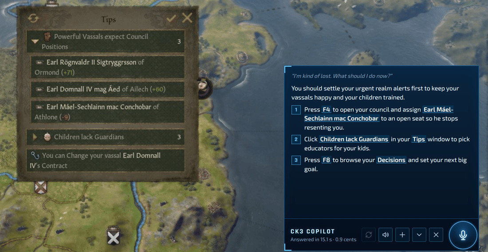
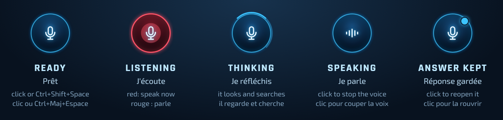
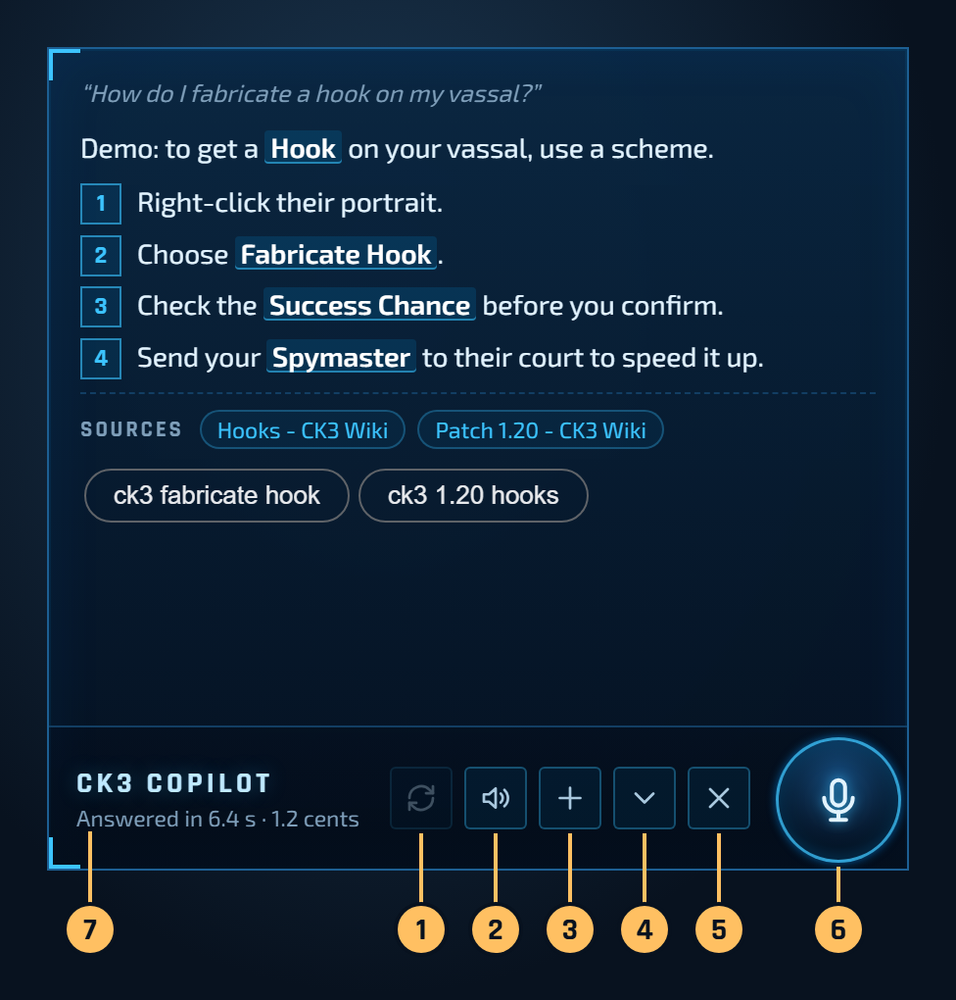
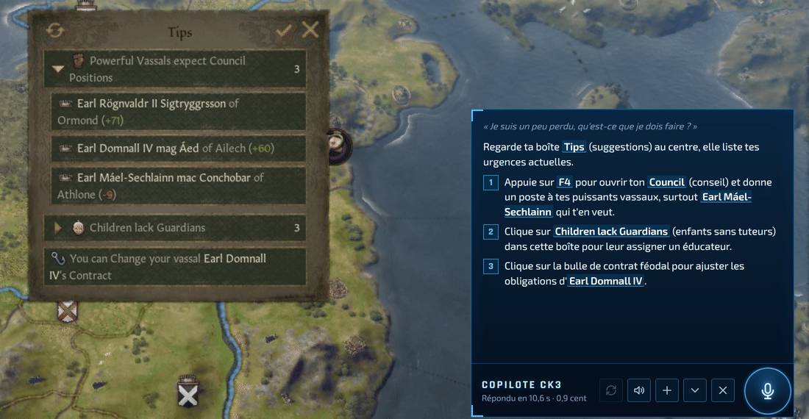
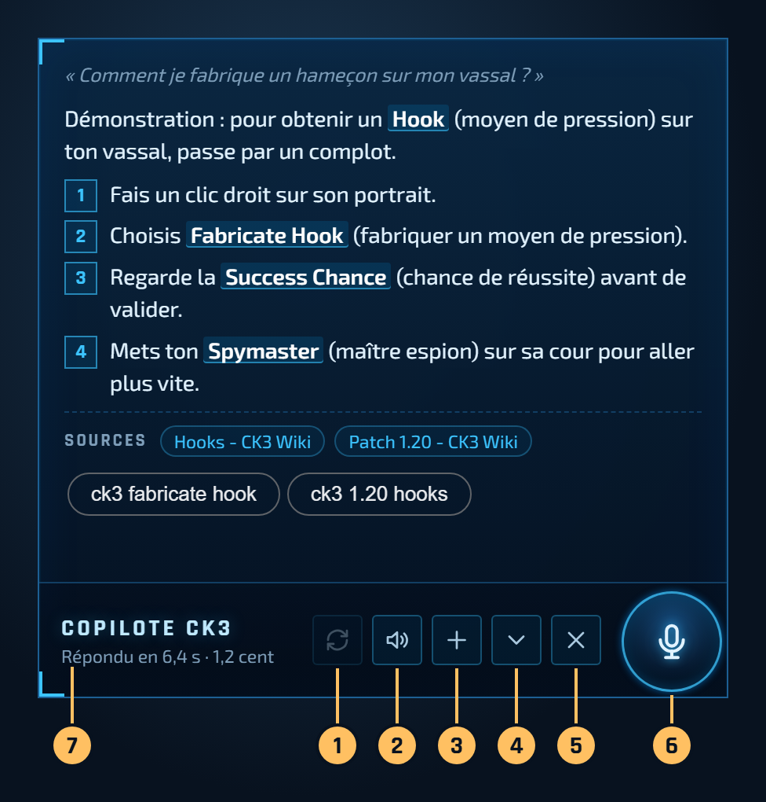

# CK3 Copilot: step-by-step guide

This guide is for players, not developers. You will not need to type any command: you download a folder, double-click an installer, paste a key, and play.

*Version française : [plus bas](#version-française).*



*A real answer from the copilot for this game screen (CK3 1.20, English). The panel was dragged to the right by the player; by default it opens to the left of the game's main windows.*

**Contents:** [1. What you need](#1-what-you-need) · [2. Get a Google Gemini key](#2-get-a-google-gemini-key) · [3. Download the copilot](#3-download-the-copilot) · [4. Run the installer](#4-run-the-installer) · [5. Start CK3 and the copilot](#5-start-ck3-and-the-copilot) · [6. Your first question](#6-your-first-question) · [7. Show it things while you talk](#7-show-it-things-while-you-talk) · [8. Language, voice and other settings](#8-language-voice-and-other-settings) · [9. What it costs](#9-what-it-costs) · [10. Privacy](#10-privacy) · [11. Troubleshooting](#11-troubleshooting) · [12. Update](#12-update) · [13. Uninstall](#13-uninstall)

## 1. What you need

- A PC with **Windows 10 or 11** (64-bit) and a **microphone** (a headset works best).
- **Crusader Kings III** on Steam, with the game language set to **English**. The copilot was tested with CK3 1.20, in Fullscreen mode at 1920 × 1080, on a single screen.
- A **Google account**. Google requires you to be 18 or older to use its Gemini API.
- An Internet connection, and about **600 MB** of free disk space.
- **Node.js**, a free program that is only used during installation. If you don't have it, the installer tells you how to get it.

## 2. Get a Google Gemini key

The copilot uses Google's AI (Gemini) to understand your question, look at the game and answer out loud. To use it, you need your own key: a long code that links the copilot to your Google account.

1. Go to **[aistudio.google.com/apikey](https://aistudio.google.com/apikey)** and sign in with your Google account.
2. The first time, accept the terms. Google then creates a project for you, and often a first key.
3. If no key is listed, click **Create API key**.
4. Copy the key (copy button next to it). Keep it somewhere safe for step 4, and treat it like a password: anyone who has it can spend your credit.
5. **Turn on billing (recommended).** On the same page, in the **Billing Tier** column, click **Set up billing**, choose your country and a payment method. New accounts prepay at least **$5**.

**Why billing is recommended.** Google also offers a free tier, but:

- On the free tier, Google says it may use what you send to improve its products, and human reviewers may read it. For the copilot, that means your spoken questions and the pictures of your game. (Google's terms say that in the European Economic Area, Switzerland and the UK, the paid-tier data rules apply even to free use.)
- The copilot asks Google Search to check facts with every answer, and Google lists Search as **not available on the free tier** for its Gemini 3 models. The copilot has not been tested with a free key: expect some answers to fail, or to come without the online check.
- The free tier has daily limits that a long game session can reach.

On the paid tier, Google does not use your prompts or answers to improve its products. A $5 prepayment is about 500 questions at today's prices (see [What it costs](#9-what-it-costs)).

**OpenAI key (optional).** If you also have an OpenAI key, the copilot uses it as a backup when Google refuses (no credit left, outage). You can add it later in the `.env` file (see [section 8](#8-language-voice-and-other-settings)).

## 3. Download the copilot

1. On the [copilot's GitHub page](https://github.com/ameuryamani-lab/copilote-ck3), click the green **Code** button, then **Download ZIP**.
2. Open your Downloads folder, **right-click** the ZIP file, then **Extract All...**.
3. Choose a folder you will keep, for example `C:\Games\CK3 Copilot`. Avoid the Downloads folder (easy to clean up by mistake) and folders synced by OneDrive (the copilot takes about 400 MB).

Do not run anything from inside the ZIP: always extract it first.

## 4. Run the installer

Open the extracted folder and **double-click `Installer-Copilote-CK3.cmd`**. A black window opens; every message is shown in English, then in French.

> **Windows may warn you,** because the file comes from the Internet and is not signed by a company:
> - "Windows protected your PC": click **More info**, then **Run anyway**.
> - "Open File - Security Warning": click **Run**.
>
> The installer is plain text: you can open `Installer-Copilote-CK3.cmd` and `installer.ps1` with Notepad and read what they do before you run them.

The installer goes through 5 steps:

1. **Windows and folder.** It checks that you have Windows 10 or 11 and that the folder is complete.
2. **Node.js.** If Node.js is missing or too old, it explains what to do and offers to open [nodejs.org](https://nodejs.org/) in your browser. Download the version marked **LTS**, install it with the default options (you don't need "Tools for Native Modules"), then double-click the installer again. The installer never downloads or runs a program by itself.
3. **Electron.** It installs the app's engine, Electron (about 150 MB). This takes from a few seconds to a few minutes, depending on your connection.
4. **Your Gemini key.** It asks you to paste your key: press **Ctrl+V** (or right-click), then **Enter**. The key shows as stars (`*****`): that is normal. The installer checks the key with Google, then saves it in a file named `.env`, in the copilot's folder, on your PC only. No key yet? Press Enter to skip, and run the installer again later.
5. **Shortcut and microphone.** It creates a **CK3 Copilot** shortcut on your desktop and checks that Windows lets desktop apps use the microphone.

It ends with "Installation finished!". Press Enter to close the window.

This is what you should see (each line is followed by its French version):

```
[1/5] Checking Windows and this folder
Windows 11 (build 26200), 64-bit: OK.
[2/5] Checking Node.js (only needed to install)
Node.js 22.23.2 found.
[3/5] Installing the app engine (Electron)
Installing the packages (npm)... about one minute.
Downloading Electron (about 150 MB): this can take a few minutes...
Electron 44.5.1 installed.
[4/5] Google Gemini key
Gemini key / Clé Gemini: ***************************************
Google accepts this key.
Key saved in .env (on this PC only).
[5/5] Desktop shortcut and microphone
Desktop shortcut "CK3 Copilot" created.
Microphone: not blocked by Windows.
Installation finished!
```

You can run the installer again at any time: it only does what is missing, and keeps your key.

## 5. Start CK3 and the copilot

1. Start **Crusader Kings III** and load your game.
2. Double-click **CK3 Copilot** on your desktop (or `Lancer-Copilote-CK3.cmd` in the copilot's folder).
3. A round microphone icon appears on the right of the screen. It shows for 15 seconds even without the game, then only while CK3 is the window in front.

The copilot also puts a small icon next to the clock (it may be hidden behind the **^** arrow). Right-click it for the settings (see [section 8](#8-language-voice-and-other-settings)). You can drag the microphone icon anywhere.

## 6. Your first question



1. In the game, press **Ctrl+Shift+Space**, or click the microphone icon. The icon turns **red**: speak.
2. Ask your question out loud, for example "What should I do now?" or "How do I get a hook on this vassal?". When you stop talking, it stops listening by itself.
3. The panel opens and says what the copilot is doing ("Looking at your screen…", "Thinking…"), with a turning arc around the icon. A few seconds later, the answer appears and is read aloud.

**Walkie-talkie mode:** hold **Ctrl+Shift+Space** (more than half a second) while you talk, and release the keys when you are done.

Answers are short: one sentence, then 2 to 4 steps that say where to click, 70 words at most. Button names are quoted in English, exactly as on screen. The copilot remembers the last 4 questions for 10 minutes, so you can follow up with "and then?".

The copilot never presses a key or clicks in the game: it only advises. The game does not pause by itself; press Space if you want to take your time.



1. **Replay the voice** (available as soon as the voice has started).
2. **Voice on / off.**
3. **New question.**
4. **Minimize:** the panel folds back into the icon and keeps the answer (blue dot). Click the icon to open it again, for example after opening the game window the answer talks about.
5. **Close.**
6. **The microphone icon.** While the copilot speaks, a click stops the voice.
7. **Status line:** how long the answer took and what it cost. Drag the panel by any empty spot to move it: it will stay there.

## 7. Show it things while you talk

The copilot does not only look at the screen when you press the keys. **During your whole question, it keeps watching the CK3 window** (a light look about once per second), then sends up to 4 views with your question, plus a zoom around the mouse cursor to read the tooltip you are hovering.

So you can talk to it as you would to a friend sitting next to you: "Look at this county, is it worth taking?" while you hover the county, or open a window while you ask about it.

**Tip:** stop the mouse for half a second on what you want it to see. CK3 opens its tooltips when the mouse rests, and the copilot prefers the moments when the mouse was still.

Only the CK3 window is captured: never your desktop or other programs, and never windows on top of the game (including the copilot itself). The views stay in memory and are dropped after the question; only the last image sent is kept on disk (see [Privacy](#10-privacy)).

## 8. Language, voice and other settings

Right-click the copilot's icon next to the clock:

- **Voice on / Voice off:** answers read aloud or not (the panel button 2 does the same).
- **Forget the conversation:** the next question starts fresh.
- **Reset the icon and panel position.**
- **Langue / Language:** Français or English. By default the copilot follows your Windows language. Changing the language also clears the conversation.
- **Quit.**

Two optional settings go in the `.env` file, in the copilot's folder. To edit it: right-click `.env` > **Open with** > **Notepad**, change the line, save.

- `COPILOTE_LANGUE=en` or `fr`: the answer language until you pick one in the menu.
- `COPILOTE_PRENOM=YourFirstName`: the copilot calls you by your first name (otherwise it talks to "the player").
- `OPENAI_API_KEY=`: paste an OpenAI key after the `=` sign if you want the backup.

Restart the copilot (menu > **Quit**, then the desktop shortcut) after changing `.env`.

## 9. What it costs

The copilot itself is free. You pay Google for what it uses, with your own key:

| | Per question | $5 of credit |
|---|---|---|
| Until 31 December 2026 (Google's promotional prices) | about 1 cent | about 500 questions |
| From 1 January 2027 (Google has announced it doubles these prices) | close to 2 cents | about 250 questions |

Two hours of play usually means $0.25 to $0.50 today. Google Search checks are free up to 5,000 per month. Each question is logged with its cost in the `journal\copilote-ck3` folder, and the panel shows the cost of each answer. You can follow your spending in Google AI Studio.

Prices checked on 7 October 2026; Google may change them.

## 10. Privacy

- **Microphone:** it opens only when you press the keys or click the icon, and the icon stays red while it listens. Your voice is not saved on your PC.
- **Screen:** only the CK3 window is captured, only during a question (40 seconds at most), and the views stay in memory.
- **What is sent, and to whom:** your recorded question, up to 4 views of the CK3 window and the last few exchanges go to Google (or to OpenAI if you added a backup key and Google fails). Nothing is sent to the author of the copilot.
- **What stays on your PC**, in the copilot's folder:
  - `.env`: your key and settings;
  - `memoire\copilote-ck3\`: settings, icon position, a copy of the game's Encyclopedia texts, and `derniere-capture.jpg`, the last image sent (replaced at every question, kept to help with troubleshooting);
  - `journal\copilote-ck3\`: your questions, the answers and their cost, and the app's log.
- **Network:** the copilot's small local server only listens on your own PC (127.0.0.1): nobody on your network can reach it.
- **Google's free tier:** see [section 2](#2-get-a-google-gemini-key).

## 11. Troubleshooting

**The icon does not show over the game.**
The icon only shows while CK3 is the window in front. If you still don't see it, switch CK3 to window mode: **Settings**, **Display Mode**, **Window**. Clicking the copilot's icon next to the clock also shows it for 15 seconds, and **Reset the icon and panel position** brings it back to its place.

**Ctrl+Shift+Space does nothing.**
Click the microphone icon instead. If the status line says "Shortcut unavailable: click the icon", another program uses this shortcut. "(shortcut toggles only)" means the shortcut works, but not as a walkie-talkie.

**"The microphone is blocked".**
Open Windows **Settings > Privacy & security > Microphone**, and turn on **Microphone access** and **Let desktop apps access your microphone**. For "No microphone found", plug in your headset. For "The microphone is not responding", check that no other program uses it, and that the right microphone is selected in **Settings > System > Sound > Input**.

**"Electron not found" when you start the copilot.**
The installation is not finished: double-click `Installer-Copilote-CK3.cmd` again.

**Windows refuses to open the installer.**
Right-click the ZIP file you downloaded > **Properties** > tick **Unblock** at the bottom > **OK**, then extract it again. If the installer says you opened it "from inside the ZIP", extract the ZIP first (see [section 3](#3-download-the-copilot)).

**Your antivirus warns about the copilot.**
The copilot has a small Windows helper, `aide-windows.ps1`, run by Windows PowerShell. It does two things that antivirus programs watch closely:

- it captures the CK3 window (and only that window) to show it to the AI;
- it uses a **low-level keyboard hook**, the Windows feature that also lets programs see keys pressed in other windows. Keyloggers use it too, which is why some antivirus programs flag it. Here, the helper only reacts to **Ctrl+Shift+Space**, and only while CK3 is in front: it holds back that one combination (otherwise CK3 would also see Space and pause or unpause the game), lets every other key through untouched, records nothing and sends nothing. It never sends keys or clicks. A hook is needed because Windows' normal shortcut system cannot tell when the keys are released (needed for the walkie-talkie mode) and would take the shortcut away from every other program.

The code is open: you can read `aide-windows.ps1`, or ask someone you trust to check it. If your antivirus moved a file to quarantine, you can restore it and allow the copilot's folder, or simply not use the copilot. Do not turn your antivirus off.

**No answer, or "No AI key found".**
- "No AI key found": the key is missing from `.env`. Run the installer again, it will ask for it.
- "Google credit is used up": add credit in Google AI Studio (Billing).
- "Google is not responding": check your Internet connection, and check that your key still exists in AI Studio. On a free key, see [section 2](#2-get-a-google-gemini-key).

**"CK3 isn't running" while the game is open.**
CK3 must be running and not minimized. Click in the game, then ask again.

**The answer comes in the wrong language.**
Right-click the copilot's icon next to the clock > **Langue / Language**.

**A wrong answer?**
The copilot is in beta and can make mistakes. You can report it in the [Issues](https://github.com/ameuryamani-lab/copilote-ck3/issues) tab, with the question you asked.

## 12. Update

1. Quit the copilot (right-click its icon next to the clock > **Quit**).
2. Download the new ZIP and extract it **into the same folder**, replacing the files. Your `.env`, settings and logs are not in the ZIP, so they are kept.
3. Double-click `Installer-Copilote-CK3.cmd` again: it updates Electron if needed.

## 13. Uninstall

1. Quit the copilot (right-click its icon next to the clock > **Quit**).
2. Delete the copilot's folder. This also deletes your key, settings and logs.
3. Delete the **CK3 Copilot** shortcut from your desktop.
4. Optional: delete the folders `%APPDATA%\copilote-ck3` (Electron's data for the copilot) and `%LOCALAPPDATA%\electron\Cache` (the Electron download, about 150 MB; other Electron-based programs you install yourself may use it too). Type these names in the File Explorer address bar to open them.
5. Optional: uninstall Node.js (**Settings > Apps**) if you don't use it for anything else, and delete your key in Google AI Studio if you won't use it anymore.

---

## Version française

Ce guide s'adresse aux joueurs, pas aux développeurs. Tu n'auras aucune commande à taper : tu télécharges un dossier, tu double-cliques sur une installation, tu colles une clé, et tu joues.



*Une vraie réponse du copilote pour cet écran de jeu (CK3 1.20, en anglais). Le joueur a fait glisser le panneau à droite ; par défaut, il s'ouvre à gauche des fenêtres principales du jeu.*

**Sommaire :** [1. Ce qu'il te faut](#1-ce-quil-te-faut) · [2. Obtenir une clé Google Gemini](#2-obtenir-une-clé-google-gemini) · [3. Télécharger le copilote](#3-télécharger-le-copilote) · [4. Lancer l'installation](#4-lancer-linstallation) · [5. Lancer CK3 et le copilote](#5-lancer-ck3-et-le-copilote) · [6. Ta première question](#6-ta-première-question) · [7. Lui montrer des choses en parlant](#7-lui-montrer-des-choses-en-parlant) · [8. Langue, voix et autres réglages](#8-langue-voix-et-autres-réglages) · [9. Ce que ça coûte](#9-ce-que-ça-coûte) · [10. Vie privée](#10-vie-privée) · [11. En cas de problème](#11-en-cas-de-problème) · [12. Mettre à jour](#12-mettre-à-jour) · [13. Désinstaller](#13-désinstaller)

### 1. Ce qu'il te faut

- Un PC sous **Windows 10 ou 11** (64 bits) et un **micro** (un casque micro, c'est le mieux).
- **Crusader Kings III** sur Steam, avec le jeu réglé en **anglais**. Le copilote a été essayé avec CK3 1.20, en mode « Fullscreen » à 1920 × 1080, sur un seul écran.
- Un **compte Google**. Google demande d'avoir 18 ans ou plus pour utiliser son API Gemini.
- Une connexion Internet et environ **600 Mo** d'espace libre.
- **Node.js**, un programme gratuit qui ne sert que pendant l'installation. Si tu ne l'as pas, l'installation t'explique comment l'obtenir.

### 2. Obtenir une clé Google Gemini

Le copilote utilise l'IA de Google (Gemini) pour comprendre ta question, regarder le jeu et te répondre à voix haute. Il te faut pour cela ta propre clé : un long code qui relie le copilote à ton compte Google.

1. Va sur **[aistudio.google.com/apikey](https://aistudio.google.com/apikey)** et connecte-toi avec ton compte Google.
2. La première fois, accepte les conditions. Google crée alors un projet pour toi, et souvent une première clé.
3. Si aucune clé n'apparaît, clique sur **Create API key**.
4. Copie la clé (bouton de copie à côté). Garde-la pour l'étape 4, et traite-la comme un mot de passe : quiconque l'a peut dépenser ton crédit.
5. **Active la facturation (conseillé).** Sur la même page, dans la colonne **Billing Tier**, clique sur **Set up billing**, choisis ton pays et un moyen de paiement. Les nouveaux comptes paient d'avance au moins **5 $**.

**Pourquoi la facturation est conseillée.** Google propose aussi une offre gratuite, mais :

- Avec l'offre gratuite, Google dit pouvoir utiliser ce que tu envoies pour améliorer ses produits, et des personnes peuvent le relire. Pour le copilote, ce sont tes questions dites à voix haute et les images de ton jeu. (Les conditions de Google disent que dans l'Espace économique européen, en Suisse et au Royaume-Uni, les règles de l'offre payante s'appliquent même à l'usage gratuit.)
- Le copilote demande à la recherche Google de vérifier les faits à chaque réponse, et Google indique que la recherche **n'est pas disponible dans l'offre gratuite** pour ses modèles Gemini 3. Le copilote n'a pas été essayé avec une clé gratuite : attends-toi à ce que certaines réponses échouent, ou arrivent sans vérification sur Internet.
- L'offre gratuite a des limites par jour qu'une longue partie peut atteindre.

Avec l'offre payante, Google n'utilise ni tes demandes ni les réponses pour améliorer ses produits. 5 $ d'avance font environ 500 questions aux prix actuels (voir [Ce que ça coûte](#9-ce-que-ça-coûte)).

**Clé OpenAI (facultative).** Si tu as aussi une clé OpenAI, le copilote s'en sert de secours quand Google refuse (plus de crédit, panne). Tu pourras l'ajouter plus tard dans le fichier `.env` (voir [la partie 8](#8-langue-voix-et-autres-réglages)).

### 3. Télécharger le copilote

1. Sur la [page GitHub du copilote](https://github.com/ameuryamani-lab/copilote-ck3), clique sur le bouton vert **Code**, puis sur **Download ZIP**.
2. Ouvre ton dossier Téléchargements, fais un **clic droit** sur le fichier ZIP, puis **Extraire tout...**.
3. Choisis un dossier que tu garderas, par exemple `C:\Jeux\Copilote CK3`. Évite le dossier Téléchargements (facile à vider par erreur) et les dossiers synchronisés par OneDrive (le copilote prend environ 400 Mo).

Ne lance rien depuis l'intérieur du ZIP : extrais-le toujours d'abord.

### 4. Lancer l'installation

Ouvre le dossier extrait et **double-clique sur `Installer-Copilote-CK3.cmd`**. Une fenêtre noire s'ouvre ; chaque message est écrit en anglais, puis en français.

> **Windows peut t'avertir,** parce que le fichier vient d'Internet et n'est pas signé par une entreprise :
> - « Windows a protégé votre ordinateur » : clique sur **Informations complémentaires**, puis **Exécuter quand même**.
> - « Fichier ouvert - Avertissement de sécurité » : clique sur **Exécuter**.
>
> L'installation est du simple texte : tu peux ouvrir `Installer-Copilote-CK3.cmd` et `installer.ps1` avec le Bloc-notes et lire ce qu'ils font avant de les lancer.

L'installation passe par 5 étapes :

1. **Windows et dossier.** Elle vérifie que tu as Windows 10 ou 11 et que le dossier est complet.
2. **Node.js.** S'il manque ou s'il est trop ancien, elle t'explique quoi faire et te propose d'ouvrir [nodejs.org](https://nodejs.org/) dans ton navigateur. Télécharge la version marquée **LTS**, installe-la avec les options par défaut (« Tools for Native Modules » est inutile), puis double-clique de nouveau sur l'installation. Elle ne télécharge et ne lance jamais de programme d'elle-même.
3. **Electron.** Elle installe le moteur de l'appli, Electron (environ 150 Mo). Cela prend de quelques secondes à quelques minutes selon ta connexion.
4. **Ta clé Gemini.** Elle te demande de coller ta clé : **Ctrl+V** (ou clic droit), puis **Entrée**. La clé s'affiche en étoiles (`*****`) : c'est normal. L'installation vérifie la clé auprès de Google, puis l'enregistre dans un fichier nommé `.env`, dans le dossier du copilote, sur ton PC seulement. Pas encore de clé ? Appuie sur Entrée pour passer, et relance l'installation plus tard.
5. **Raccourci et micro.** Elle crée un raccourci **CK3 Copilot** sur ton Bureau et vérifie que Windows laisse les applis de bureau utiliser le micro.

Elle se termine par « Installation terminée ! ». Appuie sur Entrée pour fermer la fenêtre.

Voici ce que tu dois voir (chaque ligne en français suit sa version anglaise) :

```
[1/5] Vérification de Windows et de ce dossier
Windows 11 (build 26200), 64 bits : OK.
[2/5] Vérification de Node.js (utile seulement pour installer)
Node.js 22.23.2 trouvé.
[3/5] Installation du moteur de l'appli (Electron)
Installation des paquets (npm)... environ une minute.
Téléchargement d'Electron (environ 150 Mo) : cela peut prendre quelques minutes...
Electron 44.5.1 installé.
[4/5] Clé Google Gemini
Gemini key / Clé Gemini: ***************************************
Google accepte cette clé.
Clé enregistrée dans .env (sur ce PC seulement).
[5/5] Raccourci sur le Bureau et micro
Raccourci "CK3 Copilot" créé sur le Bureau.
Micro : pas bloqué par Windows.
Installation terminée !
```

Tu peux relancer l'installation quand tu veux : elle ne fait que ce qui manque, et garde ta clé.

### 5. Lancer CK3 et le copilote

1. Lance **Crusader Kings III** et charge ta partie.
2. Double-clique sur **CK3 Copilot** sur ton Bureau (ou sur `Lancer-Copilote-CK3.cmd` dans le dossier du copilote).
3. Une icône ronde avec un micro apparaît à droite de l'écran. Elle reste 15 secondes même sans le jeu, puis seulement quand CK3 est la fenêtre au premier plan.

Le copilote met aussi une petite icône près de l'horloge (elle peut être cachée derrière la flèche **^**). Fais un clic droit dessus pour les réglages (voir [la partie 8](#8-langue-voix-et-autres-réglages)). Tu peux faire glisser l'icône micro où tu veux.

### 6. Ta première question


1. Dans le jeu, appuie sur **Ctrl+Maj+Espace**, ou clique sur l'icône micro. L'icône devient **rouge** : parle.
2. Pose ta question à voix haute, par exemple « Qu'est-ce que je dois faire maintenant ? » ou « Comment obtenir un moyen de pression sur ce vassal ? ». Quand tu te tais, il arrête d'écouter tout seul.
3. Le panneau s'ouvre et dit ce que fait le copilote (« Je regarde ton écran… », « Je réfléchis… »), avec un arc qui tourne autour de l'icône. Quelques secondes plus tard, la réponse s'affiche et il la lit à voix haute.

**Mode talkie-walkie :** garde **Ctrl+Maj+Espace** enfoncé (plus d'une demi-seconde) pendant que tu parles, et lâche les touches quand tu as fini.

Les réponses sont courtes : une phrase, puis 2 à 4 étapes qui disent où cliquer, 70 mots au plus. Les noms des boutons sont donnés en anglais, exactement comme à l'écran. Le copilote se souvient des 4 dernières questions pendant 10 minutes : tu peux enchaîner avec « et ensuite ? ».

Le copilote n'appuie jamais sur une touche et ne clique jamais dans le jeu : il conseille seulement. Le jeu ne se met pas en pause tout seul ; appuie sur Espace si tu veux prendre ton temps.



1. **Répéter la voix** (disponible dès que la voix a commencé).
2. **Voix activée / coupée.**
3. **Nouvelle question.**
4. **Réduire :** le panneau se replie dans l'icône en gardant la réponse (point bleu). Clique sur l'icône pour la rouvrir, par exemple après avoir ouvert la fenêtre du jeu dont parle la réponse.
5. **Fermer.**
6. **L'icône micro.** Pendant que le copilote parle, un clic coupe la voix.
7. **Ligne d'état :** le temps de la réponse et son coût. Fais glisser le panneau par n'importe quel endroit vide pour le déplacer : il restera là.

### 7. Lui montrer des choses en parlant

Le copilote ne regarde pas l'écran seulement au moment où tu appuies. **Pendant toute ta question, il continue de regarder la fenêtre de CK3** (un coup d'œil léger environ une fois par seconde), puis envoie jusqu'à 4 vues avec ta question, plus un zoom autour du curseur de la souris pour lire l'info-bulle que tu survoles.

Tu peux donc lui parler comme à un ami assis à côté de toi : « Regarde ce comté, ça vaut le coup de le prendre ? » en survolant le comté, ou ouvrir une fenêtre pendant que tu poses ta question.

**Astuce :** arrête la souris une demi-seconde sur ce que tu veux qu'il voie. CK3 ouvre ses info-bulles quand la souris s'arrête, et le copilote préfère les moments où la souris était immobile.

Seule la fenêtre de CK3 est capturée : jamais ton Bureau ni tes autres programmes, et jamais les fenêtres posées sur le jeu (le copilote compris). Les vues restent en mémoire et sont oubliées après la question ; seule la dernière image envoyée est gardée sur le disque (voir [Vie privée](#10-vie-privée)).

### 8. Langue, voix et autres réglages

Fais un clic droit sur l'icône du copilote près de l'horloge :

- **Voix activée / Voix désactivée :** réponses lues à voix haute ou non (le bouton 2 du panneau fait la même chose).
- **Oublier la conversation :** la question suivante repart de zéro.
- **Replacer l'icône et le panneau.**
- **Langue / Language :** Français ou English. Par défaut, le copilote suit la langue de Windows. Changer de langue efface aussi la conversation.
- **Quitter.**

Deux réglages facultatifs se mettent dans le fichier `.env`, dans le dossier du copilote. Pour le modifier : clic droit sur `.env` > **Ouvrir avec** > **Bloc-notes**, change la ligne, enregistre.

- `COPILOTE_LANGUE=fr` ou `en` : la langue des réponses tant que tu n'en as pas choisi une dans le menu.
- `COPILOTE_PRENOM=TonPrénom` : le copilote t'appelle par ton prénom (sinon il parle « au joueur »).
- `OPENAI_API_KEY=` : colle une clé OpenAI après le signe `=` si tu veux le secours.

Relance le copilote (menu > **Quitter**, puis le raccourci du Bureau) après avoir modifié `.env`.

### 9. Ce que ça coûte

Le copilote lui-même est gratuit. Tu paies à Google ce qu'il utilise, avec ta propre clé :

| | Par question | 5 $ de crédit |
|---|---|---|
| Jusqu'au 31 décembre 2026 (prix promotionnels de Google) | environ 1 cent | environ 500 questions |
| À partir du 1er janvier 2027 (Google a annoncé qu'il double ces prix) | près de 2 cents | environ 250 questions |

Deux heures de jeu coûtent en général de 0,25 à 0,50 $ aujourd'hui. Les vérifications par la recherche Google sont gratuites jusqu'à 5 000 par mois. Chaque question est notée avec son coût dans le dossier `journal\copilote-ck3`, et le panneau affiche le coût de chaque réponse. Tu peux suivre tes dépenses dans Google AI Studio.

Prix vérifiés le 7 octobre 2026 ; Google peut les changer.

### 10. Vie privée

- **Micro :** il ne s'ouvre que quand tu appuies sur les touches ou cliques sur l'icône, et l'icône reste rouge pendant qu'il écoute. Ta voix n'est pas enregistrée sur ton PC.
- **Écran :** seule la fenêtre de CK3 est capturée, seulement pendant une question (40 secondes au plus), et les vues restent en mémoire.
- **Ce qui part, et chez qui :** ta question enregistrée, jusqu'à 4 vues de la fenêtre de CK3 et les derniers échanges partent chez Google (ou chez OpenAI si tu as ajouté une clé de secours et que Google échoue). Rien n'est envoyé à l'auteur du copilote.
- **Ce qui reste sur ton PC**, dans le dossier du copilote :
  - `.env` : ta clé et tes réglages ;
  - `memoire\copilote-ck3\` : réglages, position de l'icône, une copie des textes de l'Encyclopédie du jeu, et `derniere-capture.jpg`, la dernière image envoyée (remplacée à chaque question, gardée pour aider en cas de problème) ;
  - `journal\copilote-ck3\` : tes questions, les réponses et leur coût, et le journal de l'appli.
- **Réseau :** le petit serveur local du copilote n'écoute que sur ton propre PC (127.0.0.1) : personne sur ton réseau ne peut le joindre.
- **Offre gratuite de Google :** voir [la partie 2](#2-obtenir-une-clé-google-gemini).

### 11. En cas de problème

**L'icône n'apparaît pas sur le jeu.**
L'icône ne s'affiche que quand CK3 est la fenêtre au premier plan. Si tu ne la vois toujours pas, passe CK3 en mode fenêtre : **Settings**, **Display Mode**, **Window**. Un clic sur l'icône du copilote près de l'horloge l'affiche aussi 15 secondes, et **Replacer l'icône et le panneau** la remet à sa place.

**Ctrl+Maj+Espace ne fait rien.**
Clique plutôt sur l'icône micro. Si la ligne d'état dit « Raccourci indisponible : clique sur l'icône », un autre programme utilise ce raccourci. « (raccourci en bascule seulement) » veut dire que le raccourci marche, mais pas en talkie-walkie.

**« Le micro est bloqué ».**
Ouvre les **Paramètres** de Windows > **Confidentialité et sécurité** > **Microphone**, et active **Accès au microphone** et **Autoriser les applications de bureau à accéder au microphone**. Pour « Aucun micro trouvé », branche ton casque. Pour « Le micro ne répond pas », vérifie qu'aucun autre programme ne l'utilise et que le bon micro est choisi dans **Paramètres > Système > Son > Entrée**.

**« Electron not found / Electron introuvable » au lancement.**
L'installation n'est pas finie : double-clique de nouveau sur `Installer-Copilote-CK3.cmd`.

**Windows refuse d'ouvrir l'installation.**
Clic droit sur le fichier ZIP téléchargé > **Propriétés** > coche **Débloquer** en bas > **OK**, puis extrais-le de nouveau. Si l'installation dit que tu l'as ouverte « depuis l'intérieur du ZIP », extrais d'abord le ZIP (voir [la partie 3](#3-télécharger-le-copilote)).

**Ton antivirus se méfie du copilote.**
Le copilote a une petite aide Windows, `aide-windows.ps1`, lancée par Windows PowerShell. Elle fait deux choses que les antivirus surveillent de près :

- elle capture la fenêtre de CK3 (et seulement elle) pour la montrer à l'IA ;
- elle utilise un **crochet clavier bas niveau**, la fonction de Windows qui permet aussi à un programme de voir les touches tapées dans les autres fenêtres. Les enregistreurs de frappe s'en servent aussi, d'où la méfiance de certains antivirus. Ici, l'aide ne réagit qu'à **Ctrl+Maj+Espace**, et seulement quand CK3 est au premier plan : elle retient cette seule combinaison (sinon CK3 verrait aussi Espace et mettrait le jeu en pause ou le relancerait), laisse passer toutes les autres touches sans y toucher, n'enregistre rien et n'envoie rien. Elle n'envoie jamais de touche ni de clic. Il faut un crochet parce que le système de raccourcis normal de Windows ne sait pas quand les touches sont relâchées (nécessaire pour le mode talkie-walkie), et prendrait le raccourci à tous les autres programmes.

Le code est ouvert : tu peux lire `aide-windows.ps1`, ou demander à quelqu'un de confiance de le vérifier. Si ton antivirus a mis un fichier en quarantaine, tu peux le restaurer et autoriser le dossier du copilote, ou simplement ne pas utiliser le copilote. Ne désactive pas ton antivirus.

**Pas de réponse, ou « Aucune clé d'IA trouvée ».**
- « Aucune clé d'IA trouvée » : la clé manque dans `.env`. Relance l'installation, elle te la demandera.
- « Crédit Google épuisé » : ajoute du crédit dans Google AI Studio (Billing).
- « Google ne répond pas » : vérifie ta connexion Internet, et que ta clé existe toujours dans AI Studio. Avec une clé gratuite, voir [la partie 2](#2-obtenir-une-clé-google-gemini).

**« CK3 n'est pas lancé » alors que le jeu est ouvert.**
CK3 doit être lancé et pas réduit. Clique dans le jeu, puis repose ta question.

**La réponse arrive dans la mauvaise langue.**
Clic droit sur l'icône du copilote près de l'horloge > **Langue / Language**.

**Une réponse fausse ?**
Le copilote est en bêta et peut se tromper. Tu peux le signaler dans l'onglet [Issues](https://github.com/ameuryamani-lab/copilote-ck3/issues), avec la question que tu as posée.

### 12. Mettre à jour

1. Quitte le copilote (clic droit sur son icône près de l'horloge > **Quitter**).
2. Télécharge le nouveau ZIP et extrais-le **dans le même dossier**, en remplaçant les fichiers. Ton `.env`, tes réglages et tes journaux ne sont pas dans le ZIP : ils sont gardés.
3. Double-clique de nouveau sur `Installer-Copilote-CK3.cmd` : il met Electron à jour si besoin.

### 13. Désinstaller

1. Quitte le copilote (clic droit sur son icône près de l'horloge > **Quitter**).
2. Supprime le dossier du copilote. Cela supprime aussi ta clé, tes réglages et tes journaux.
3. Supprime le raccourci **CK3 Copilot** de ton Bureau.
4. Facultatif : supprime les dossiers `%APPDATA%\copilote-ck3` (les données d'Electron pour le copilote) et `%LOCALAPPDATA%\electron\Cache` (le téléchargement d'Electron, environ 150 Mo ; d'autres programmes basés sur Electron que tu installes toi-même peuvent s'en servir aussi). Tape ces noms dans la barre d'adresse de l'Explorateur de fichiers pour les ouvrir.
5. Facultatif : désinstalle Node.js (**Paramètres > Applications**) si tu ne t'en sers pas pour autre chose, et supprime ta clé dans Google AI Studio si tu ne l'utilises plus.
